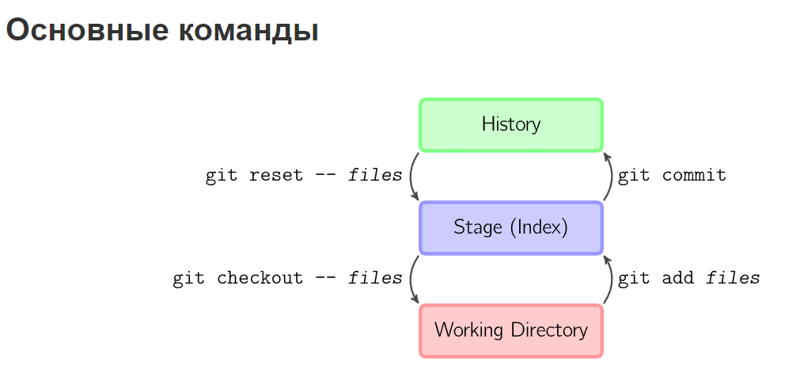
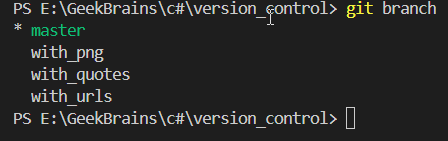
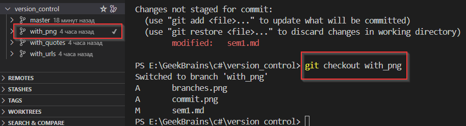
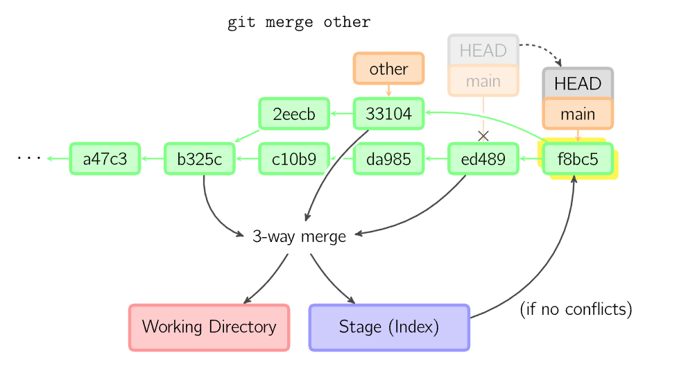

# семинар №1

 ***схема работы системы контроля версий Git и основные команды***
## Шпаргалка по базовым командам Git

**git init** - инициализация  локального  репозитория

**git add "file.name"** - Команда добавляет file.name из рабочей директории в индекс (staging area, stage, сцена) для последующего коммита. По умолчанию git commit использует лишь этот индекс, так что вы можете использовать git add для сборки слепка вашего следующего коммита.

**git commit** - команда берёт все данные, добавленные в индекс с помощью git add, и сохраняет их слепок во внутренней базе данных, а затем сдвигает указатель текущей ветки на этот слепок.

**git status** - Команда показывает состояния файлов в рабочей директории и индексе: какие файлы изменены, но не добавлены в индекс; какие ожидают коммита в индексе. Вдобавок к этому выводятся подсказки о том, как изменить состояние файлов.

**git diff** - Команда используется для вычисления разницы между любыми двумя Git деревьями. Это может быть разница между вашей рабочей директорией и индексом (собственно git diff), разница между индексом и последним коммитом (git diff --staged), или между любыми двумя коммитами (git diff master anotherBranch)

# семинар №2
## Шпаргалка по ветвлению и слиянию

**git branch** - команда git branch — это своего рода “менеджер веток”. Она умеет перечислять ваши ветки, создавать новые, удалять и переименовывать их.

**примеры использования команды ***git branch*** различными параметрами**
- ***git branch -d*** удалить локальную ветку 
- ***git branch*** посмотреть локальные ветки
- ***git branch –v*** посмотреть последний коммит на каждой из локальных веток
- ***git branch –a*** посмотреть все существующие локальные и удаленные ветки можно дать команду
- ***git branch –a*** посмотреть последние коммиты на всех ветках (локальных и удаленных)
- ***git branch –vv*** посмотреть отслеживаемые ветки
- ***git branch -u origin/serverfix*** сделать локальную ветку serverfix отслеживаемой
- ***git branch new_branch_name*** cоздать ветку
- ***git branch new_branch 5a0eb04*** cоздать ветку на определенном коммите
- ***git branch -m oldname newname*** переименовать ветку

***пример создания веток с помощью git branch***

**git checkout** - Команда checkout используется для копирования файлов из истории или индекса (stage) в рабочую директорию. Также она может использоваться для переключения между ветками.

***пример переключения веток с помощью git checkout***

**git merge** - Команда merge (слияние) создает новый коммит на основе текущего коммита, применяя изменения других коммитов. Перед слиянием индекс должен быть приведен в соответствие с текущим коммитом.Вы можете изменить стратегию слияния, но по умолчанию будет выполнено «рекурсивное» слияние, для которого будет взят текущий коммит, другой коммит (последний в другой ветке) и их общий предок, и для этих трех коммитов будет выполнено трёхстороннее слияние. Результат этого слияния будет записан в рабочую директорию и в индекс, и будет добавлен результирующий коммит со вторым родителем.

***схема работы команды merge***

**git reset** - Команда reset перемещает указатель текущей ветки в другую позицию и дополнительно может обновить сцену и рабочую директорию. Эту команду можно также использовать для того, чтобы скопировать файл из истории на сцену, не задевая рабочую директорию.

**git stash** - Команда git stash сохраняет неподтвержденные изменения (индексированные и неиндексированные) в отдельном хранилище, чтобы вы могли вернуться к ним позже. Затем происходит откат до исходной рабочей копии

**git stash pop** - Команда применяет ранее отложенные изменения

# семинар №3

## Шпаргалка по работе Git с удаленными репозиториями

**git remote** - семейство команд, обеспечивающее работу с удаленным репозиторием
- **git remote add repo_name repo_url** -  подключает удаленный репозиторий с адреса repo_url к вашему под переданным именем repo_name
- **git remote remove repo_name** - отключает удаленный репозиторий repo_name
- **git remote show** - выводит список всех подключенных удаленных репозиториев
- **git remote rename old_name new_name** - меняет имя переданного удаленного репозитория
 
**git clone URL_remote_REPO** - команда копирует удаленный репозиторий с адреса URL_remote_REPO в текущую рабочую папку

**git push** - загружает изменения в удаленный репозиторий. Если слияние изменений в удаленном репозитории нельзя сделать в режиме fast-forward, и при этом не был передан ключ force, выполнение закончится с ошибкой.

**git pull** - Получает изменения из переданного удаленного репозитория и обновляет рабочую копию в соответствии с удаленным репозиторием. По умолчанию слияние удаленной ветки с локальной происходит именно в fast-forward режиме, так что включать его специально не требуется.

## полезные ссылки:
1. [Лайфхакер-Что такое Markdown...](https://lifehacker.ru/chto-takoe-markdown/)
2. [Краткая справка по командам Git](https://www.fandroid.info/shpargalka-po-komandam-git/)
3. [Git-наглядная справка](https://marklodato.github.io/visual-git-guide/index-ru.html)
4. [Kонфликты](https://www.atlassian.com/ru/git/tutorials/using-branches/merge-conflicts)

# вроде все! спасибо!